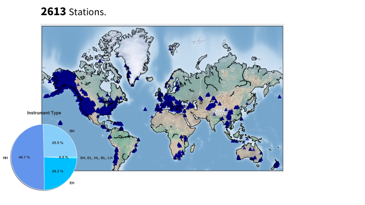
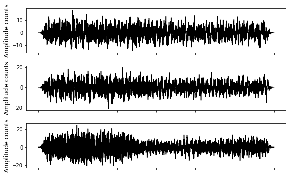
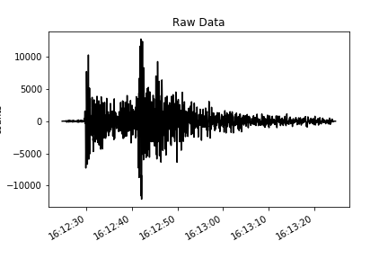
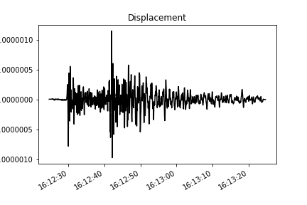
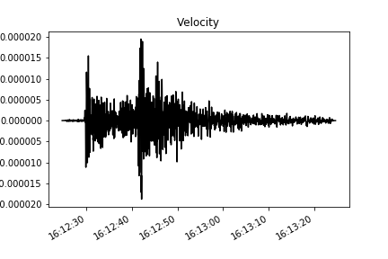
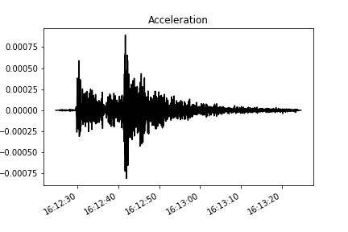

#  STanford EArthquake Dataset (STEAD):A Global Data Set of Seismic Signals for AI                                                                                           

 


-----------------------------------------




https://www.youtube.com/watch?v=Nn8KJFJu-V0

----------------------------------------- 
## Table of Contents: 
* [Downloading the dataset](#You_can_get_the_wavefoms_from_here) 
* [Description of the dataset](#You_can_get_the_paper_from_here)                                
* [How to access the earthquake waveforms](#Example_of_data_selection_and_accessing_(earthquake_waveforms)) 
* [How to access the noise waveforms](#Example_of_data_selection_and_accessing_(noise_waveforms))                   
* [How to convert raw waveforms into acceleration, velocity, or displacement](#How_to_convert_raw_waveforms_into_Acceleration,_Velocity,_or_Displacement)  
* [Studies that used STEAD](#These_are_some_of_the_studies_that_used_STEAD.)            
-----------
## Note:
#### Please note that some of the back azimuths in the current version have been misplaced. If you plan to use back azimuth labels you can recalculate it based on station and event location. Here is code to do so using Obspy:

```python
distance_m, azimuth, back_azimuth = obspy.geodetics.base.gps2dist_azimuth(
                                                                        float(event_lat), 
                                                                        float(event_lon),
                                                                        float(station_lat), 
                                                                        float(station_lon), 
                                                                        a=6378137.0, 
                                                                        f=0.0033528106647474805)
```            

### You can get the wavefoms from here: 

##### Each of the following files contains one hdf5 (data) and one CSV (metadata) files for ~ 200k 3C waveforms. You can download the chunks you need and then merge them into a single file using the provided code in the repository.

https://rebrand.ly/chunk1  (chunk1 ~ 14.6 GB) Noise

https://rebrand.ly/chunk2  (chunk2 ~ 13.7 GB) Local Earthquakes

https://rebrand.ly/chunk3  (chunk3 ~ 13.7 GB) Local Earthquakes

https://rebrand.ly/chunk4  (chunk4 ~ 13.7 GB) Local Earthquakes

https://rebrand.ly/chunk5  (chunk5 ~ 13.7 GB) Local Earthquakes

https://rebrand.ly/chunk6  (chunk6 ~ 15.7 GB) Local Earthquakes 

#### If you have a fast internet you can download the entire dataset in a single file using following links:

https://rebrand.ly/whole (merged ~ 85 GB) Local Earthquakes + Noise

* Note1: some of the unzipper programs for Windows and Linux operating systems have size limits. Try '7Zip' software if had problems unzipping the files. 

* Note2: all the metadata are also available in the hdf5 file (as attributes associated with each waveform).

* Note3: For some of the noise data waveforms are identical for 3 components. These are related to single-channel stations where we duplicated the vertical channel for horizontal ones. However, these makeup to less than 4 % of noise data. For the rest, noise is different for each channel.

#### If you had trouble downloading the data from above links or unzipping them, you can get the dataset from SeisBench

-----------------------------------

### You can get the paper from here:

https://rebrand.ly/STEADrg   or   https://rebrand.ly/STEADac

### You can use QuakeLabeler (https://maihao14.github.io/QuakeLabeler/) or SeisBench (https://github.com/seisbench/seisbench) to labele and convert your data into STEAD format.

### Last Update in the Dataset:
May 25, 2020 


### Reporting Bugs:

Report bugs at https://github.com/smousavi05/STEAD/issues.

or send me an email: smousavi05@gmail.com

-------------------------------------
Reference:

`Mousavi, S. M., Sheng, Y., Zhu, W., Beroza G.C., (2019). 
STanford EArthquake Dataset (STEAD): A Global Data Set of Seismic Signals for AI, 
IEEE Access, doi:10.1109/ACCESS.2019.2947848` 


BibTeX:

    @article{mousavi2019stanford,
      title={STanford EArthquake Dataset (STEAD): A Global Data Set of Seismic Signals for AI},
      author={Mousavi, S Mostafa and Sheng, Yixiao and Zhu, Weiqiang and Beroza, Gregory C},
      journal={IEEE Access},
      year={2019},
      publisher={IEEE}
    }

-------------------------------------

The CSV file can be used to easily select a specific part of the dataset and only read associated waveforms from the hdf5 file for efficiency.

### Example of data selection and accessing (earthquake waveforms):

```python
import pandas as pd
import h5py
import numpy as np
import matplotlib.pyplot as plt

file_name = "merge.hdf5"
csv_file = "merge.csv"

# reading the csv file into a dataframe:
df = pd.read_csv(csv_file)
print(f'total events in csv file: {len(df)}')
# filterering the dataframe
df = df[(df.trace_category == 'earthquake_local') & (df.source_distance_km <= 20) & (df.source_magnitude > 3)]
print(f'total events selected: {len(df)}')

# making a list of trace names for the selected data
ev_list = df['trace_name'].to_list()

# retrieving selected waveforms from the hdf5 file: 
dtfl = h5py.File(file_name, 'r')
for c, evi in enumerate(ev_list):
    dataset = dtfl.get('data/'+str(evi)) 
    # waveforms, 3 channels: first row: E channel, second row: N channel, third row: Z channel 
    data = np.array(dataset)

    fig = plt.figure()
    ax = fig.add_subplot(311)         
    plt.plot(data[:,0], 'k')
    plt.rcParams["figure.figsize"] = (8, 5)
    legend_properties = {'weight':'bold'}    
    plt.tight_layout()
    ymin, ymax = ax.get_ylim()
    pl = plt.vlines(dataset.attrs['p_arrival_sample'], ymin, ymax, color='b', linewidth=2, label='P-arrival')
    sl = plt.vlines(dataset.attrs['s_arrival_sample'], ymin, ymax, color='r', linewidth=2, label='S-arrival')
    cl = plt.vlines(dataset.attrs['coda_end_sample'], ymin, ymax, color='aqua', linewidth=2, label='Coda End')
    plt.legend(handles=[pl, sl, cl], loc = 'upper right', borderaxespad=0., prop=legend_properties)        
    plt.ylabel('Amplitude counts', fontsize=12) 
    ax.set_xticklabels([])

    ax = fig.add_subplot(312)         
    plt.plot(data[:,1], 'k')
    plt.rcParams["figure.figsize"] = (8, 5)
    legend_properties = {'weight':'bold'}    
    plt.tight_layout()
    ymin, ymax = ax.get_ylim()
    pl = plt.vlines(dataset.attrs['p_arrival_sample'], ymin, ymax, color='b', linewidth=2, label='P-arrival')
    sl = plt.vlines(dataset.attrs['s_arrival_sample'], ymin, ymax, color='r', linewidth=2, label='S-arrival')
    cl = plt.vlines(dataset.attrs['coda_end_sample'], ymin, ymax, color='aqua', linewidth=2, label='Coda End')
    plt.legend(handles=[pl, sl, cl], loc = 'upper right', borderaxespad=0., prop=legend_properties)        
    plt.ylabel('Amplitude counts', fontsize=12) 
    ax.set_xticklabels([])

    ax = fig.add_subplot(313)         
    plt.plot(data[:,2], 'k')
    plt.rcParams["figure.figsize"] = (8,5)
    legend_properties = {'weight':'bold'}    
    plt.tight_layout()
    ymin, ymax = ax.get_ylim()
    pl = plt.vlines(dataset.attrs['p_arrival_sample'], ymin, ymax, color='b', linewidth=2, label='P-arrival')
    sl = plt.vlines(dataset.attrs['s_arrival_sample'], ymin, ymax, color='r', linewidth=2, label='S-arrival')
    cl = plt.vlines(dataset.attrs['coda_end_sample'], ymin, ymax, color='aqua', linewidth=2, label='Coda End')
    plt.legend(handles=[pl, sl, cl], loc = 'upper right', borderaxespad=0., prop=legend_properties)        
    plt.ylabel('Amplitude counts', fontsize=12) 
    ax.set_xticklabels([])
    plt.show() 

    for at in dataset.attrs:
        print(at, dataset.attrs[at])    

    inp = input("Press a key to plot the next waveform!")
    if inp == "r":
        continue             
```


-----------------------------------------                                                                                                                                                                                   

### Example of data selection and accessing (noise waveforms):

```python
# reading the csv file into a dataframe:
df = pd.read_csv(csv_file)
print(f'total events in csv file: {len(df)}')
# filterering the dataframe
df = df[(df.trace_category == 'noise') & (df.receiver_code == 'PHOB') ]
print(f'total events selected: {len(df)}')

# making a list of trace names for the selected data
ev_list = df['trace_name'].to_list()[:200]

# retrieving selected waveforms from the hdf5 file: 
dtfl = h5py.File(file_name, 'r')
for c, evi in enumerate(ev_list):
    dataset = dtfl.get('data/'+str(evi)) 
    # waveforms, 3 channels: first row: E channel, second row: N channel, third row: Z channel 
    data = np.array(dataset)

    fig = plt.figure()
    ax = fig.add_subplot(311)         
    plt.plot(data[:,0], 'k')
    plt.rcParams["figure.figsize"] = (8, 5)
    legend_properties = {'weight':'bold'}    
    plt.tight_layout()
    plt.ylabel('Amplitude counts', fontsize=12) 
    ax.set_xticklabels([])

    ax = fig.add_subplot(312)         
    plt.plot(data[:,1], 'k')
    plt.rcParams["figure.figsize"] = (8, 5)
    legend_properties = {'weight':'bold'}    
    plt.tight_layout()     
    plt.ylabel('Amplitude counts', fontsize=12) 
    ax.set_xticklabels([])

    ax = fig.add_subplot(313)         
    plt.plot(data[:,2], 'k')
    plt.rcParams["figure.figsize"] = (8,5)
    legend_properties = {'weight':'bold'}    
    plt.tight_layout()     
    plt.ylabel('Amplitude counts', fontsize=12) 
    ax.set_xticklabels([])
    plt.show() 

    for at in dataset.attrs:
        print(at, dataset.attrs[at])    

    inp = input("Press a key to plot the next waveform!")
    if inp == "r":
        continue       
```



-----------------------------------------                                                                                    

### How to convert raw waveforms into Acceleration, Velocity, or Displacement:

```python
import obspy
import h5py
from obspy import UTCDateTime
import numpy as np
from obspy.clients.fdsn.client import Client
import matplotlib.pyplot as plt

def make_stream(dataset):
    '''
    input: hdf5 dataset
    output: obspy stream

    '''
    data = np.array(dataset)

    tr_E = obspy.Trace(data=data[:, 0])
    tr_E.stats.starttime = UTCDateTime(dataset.attrs['trace_start_time'])
    tr_E.stats.delta = 0.01
    tr_E.stats.channel = dataset.attrs['receiver_type']+'E'
    tr_E.stats.station = dataset.attrs['receiver_code']
    tr_E.stats.network = dataset.attrs['network_code']

    tr_N = obspy.Trace(data=data[:, 1])
    tr_N.stats.starttime = UTCDateTime(dataset.attrs['trace_start_time'])
    tr_N.stats.delta = 0.01
    tr_N.stats.channel = dataset.attrs['receiver_type']+'N'
    tr_N.stats.station = dataset.attrs['receiver_code']
    tr_N.stats.network = dataset.attrs['network_code']

    tr_Z = obspy.Trace(data=data[:, 2])
    tr_Z.stats.starttime = UTCDateTime(dataset.attrs['trace_start_time'])
    tr_Z.stats.delta = 0.01
    tr_Z.stats.channel = dataset.attrs['receiver_type']+'Z'
    tr_Z.stats.station = dataset.attrs['receiver_code']
    tr_Z.stats.network = dataset.attrs['network_code']

    stream = obspy.Stream([tr_E, tr_N, tr_Z])

    return stream
 
 def make_plot(tr, title='', ylab=''):
    '''
    input: trace
    
    '''
    
    fig = plt.figure()
    ax = fig.add_subplot(1, 1, 1)
    ax.plot(tr.times("matplotlib"), tr.data, "k-")
    ax.xaxis_date()
    fig.autofmt_xdate()
    plt.ylabel('counts')
    plt.title('Raw Data')
    plt.show()
    
    
if __name__ == '__main__': 

    # reading one sample trace from STEAD
    dtfl = h5py.File(file_name, 'r')
    dataset = dtfl.get('data/109C.TA_20061103161223_EV') 

    # convering hdf5 dataset into obspy sream
    st = make_stream(dataset)
    
    # ploting the verical component of the raw data
    make_plot(st[2], title='Raw Data', ylab='counts')

```



```python

    # downloading the instrument response of the station from IRIS
    client = Client("IRIS")
    inventory = client.get_stations(network=dataset.attrs['network_code'],
                                    station=dataset.attrs['receiver_code'],
                                    starttime=UTCDateTime(dataset.attrs['trace_start_time']),
                                    endtime=UTCDateTime(dataset.attrs['trace_start_time']) + 60,
                                    loc="*", 
                                    channel="*",
                                    level="response")  

    # converting into displacement
    st = make_stream(dataset)
    st = st.remove_response(inventory=inventory, output="DISP", plot=False)

    # ploting the verical component
    make_plot(st[2], title='Displacement', ylab='meters')
    
```



```python
    # converting into velocity
    st = make_stream(dataset)
    st = st.remove_response(inventory=inventory, output='VEL', plot=False) 
    
    # ploting the verical component
    make_plot(st[2], title='Velocity', ylab='meters/second')
```
        


```python
    # converting into acceleration
    st = make_stream(dataset)
    st.remove_response(inventory=inventory, output="ACC", plot=False) 
    
    # ploting the verical component
    make_plot(st[2], title='Acceleration', ylab='meters/second**2')
```



------------------------------------------

### These are some of the studies that used STEAD. 
You can check out the code repository of these studies as examples of how a Keras or Tensorflow model can be trained by STEAD in a memory efficient fashion:

*   Earthquake transformer—an attentive deep-learning model for simultaneous earthquake detection and phase picking,
    SM Mousavi, WL Ellsworth, W Zhu, LY Chuang, GC Beroza, Nature Communications 11 (1), 1-12.

*   Bayesian-deep-learning estimation of earthquake location from single-station observations,
    SM Mousavi, GC Beroza, IEEE Transactions on Geoscience and Remote Sensing, 1 - 14.
    
*   A machine‐learning approach for earthquake magnitude estimation,
    SM Mousavi, GC Beroza, Geophysical Research Letters 47 (1), e2019GL085976.

*   Complex Neural Networks for Estimating Epicentral Distance, Depth, and Magnitude of Seismic Waves,
    Ristea, Nicolae-Cătălin, and Anamaria Radoi., IEEE Geoscience and Remote Sensing Letters.
    
*   Earthquake detection and P-wave arrival time picking using capsule neural network. 
    Saad, and Chen. IEEE Transactions on Geoscience and Remote Sensing, 59(7), 6234-6243.
    
*   Prediction of intensity and location of seismic events using deep learning.
    Nicolis, Plaza, & Salas. Spatial Statistics, 42, 100442.

## License
For more details on the license of this repository see [LICENSE](https://github.com/smousavi05/STEAD/blob/master/LICENSE).
